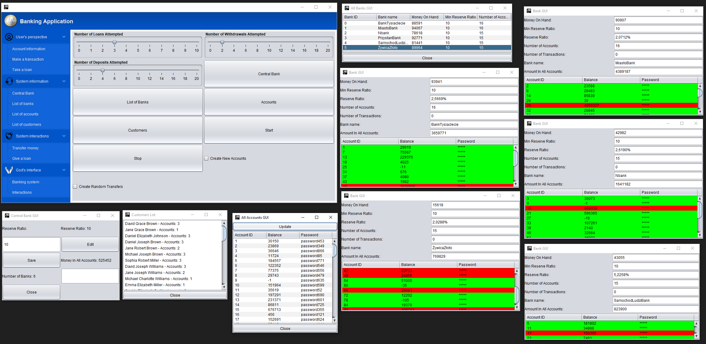

# Banking Application
## ZPOiF - group project

Group project relized as a part of advanced object and functional programming course (ZPOiF - Zaawansowane Programowanie obiektowe i Funkcyjne).

Authors: 

[@Sebislaw](https://www.github.com/Sebislaw)

[@CoolMikey](https://www.github.com/CoolMikey)

[@Zyziek055](https://www.github.com/Zyziek055)

  

Used libraries:

[miglayout:3.7.4](https://mvnrepository.com/artifact/com.miglayout/miglayout/3.7.4) from Maven Repository
